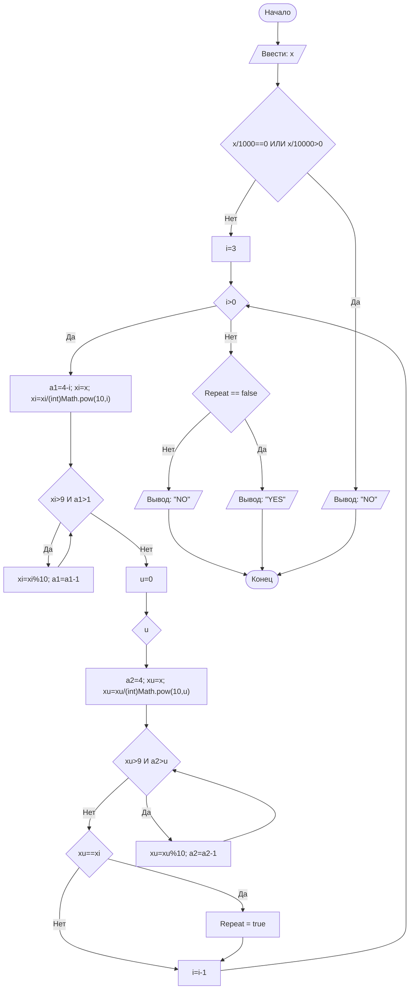

## Отчет по лабораторной работе № 1

#### № группы: `ПМ-2402`

#### Выполнил: `Хамуев Владимир Николаевич`

#### Вариант: `27`

### Cодержание:

- [Постановка задачи](#1-постановка-задачи)
- [Входные и выходные данные](#2-входные-и-выходные-данные)
- [Выбор структуры данных](#3-выбор-структуры-данных)
- [Алгоритм](#4-алгоритм)
- [Программа](#5-программа)
- [Анализ правильности решения](#6-анализ-правильности-решения)

### 1. Постановка задачи

- Условия задачи

> На вход программы подается натуральное число. Определить, является ли
оно 4-хзначным числом, все цифры которого различны ("YES"/"NO")

Данную задачу можно разделить на 2 подзадачи: определение количества знаков в числе и проверка их на повтор.

- Для 1 подзадачи нужно рассмотреть 3 случая:
  1. `X <= 9999` и `X >= 1000`
  2. `X < 1000` (отрицание 1 случая)
  3. `X > 9999` (отрицание 1 случая)
- Пусть `Z = количество повторов`, тогда для 2 подзадачи нужно рассмотреть 2 случая:
  1. `Z == 0`
  2. `Z > 0` (отрицание 1 случая)

Всего надо рассмотреть `3 * 2 = 6` случаев.

### 2. Входные и выходные данные

#### Данные на вход

На вход программа должна получать 1 число, при этом в условии сказано, что получаемое число относится к натуральным, то есть к целым положительным числам.

|           | Тип                       | min значение | max значение   |
|-----------|---------------------------|--------------|----------------|
| X (Число) | Целое положительное число | 1            | 10<sup>9</sup> |

#### Данные на выход

Т.к. программа должна вывести либо "YES", либо "NO", то на выход мы получим строку.

|        | Тип    | min значение | max значение |
|--------|--------|--------------|--------------|
| Строка | Строка | NO           | YES          |

### 3. Выбор структуры данных

Программа получает 1 целое число, не превышающее по модулю 10<sup>9</sup>. Поэтому для его хранения
можно выделить 1 переменную (`x`) типа `int`.

|           | название переменной | Тип (в Java) | 
|-----------|---------------------|--------------|
| X (Число) | `x`                 | `int`        |

Для вывода результата необязательно его хранить в отдельной переменной.

### 4. Алгоритм

1. **Ввод данных:**  
   Программа считывает целое число, обозначенное как `x`.

2. **Подсчёт знаков:**  
   Программа проверяет количество знаков в числе `x`. Если `x` входит в заданные рамки, программа переходит к следующему шагу для
   работы с `x`. Если `x` больше или меньше, программа прекращает выполнение действий.

3. **Проверка числа на повтор цифр:**
   Программа последовательно и попарно проверяет цифры в числе `x`. Если в числе найден повтор, на экран выводится строка "NO". Если в числе повтор не найден, на экран выводится строка "YES".

4. **Вывод результата:**  
   На экран выводится либо строка "YES", если число удовлетворяет условиям, либо строка "NO".

```markdown
    ```mermaid
        ([Начало]) --> B[/Ввести: a, b, x/]
        B --> C{a = 0}
        C -- Нет --> D{- b/a < 0}
        D -- Нет --> E{"-b/a = 0"}
        E -- Нет --> F[/"Вывод: -(-b/a)^0.5 <= x <= (-b/a)^0.5"/]
        E -- Да --> G[/Вывод: x = 0/]
        D -- Да --> H[/Вывод: Empty/]
        C -- Да --> I{b < 0}
        I -- Нет --> J[/Вывод: x in R/]
        I -- Да --> K[/Вывод: Empty/]
        J --> M(("-"))
        K --> M
        G --> L(("-"))
        H ----> Z
        F --> L
        M --> Z
        L --> Z([Конец])
    ``` 
```





### 5. Программа

```markdown
    ```java
        import java.io.PrintStream;
        import java.util.Scanner;

        public class Main {
        // Объявляем объект класса Scanner для ввода данных
        public static Scanner in = new Scanner(System.in);
        // Объявляем объект класса PrintStream для вывода данных
        public static PrintStream out = System.out;
        public static void main(String[] args) {
        // Считывание целого числа x из консоли
            int x = in.nextInt();
            boolean Repeat = false;
            if (x/1000==0 || x/10000>0)
            out.print("NO");
            else {
            for(int i=3, xi, a1; i>0; i--) {
                a1=4-i;
                xi=x;
                xi = xi / (int)Math.pow(10,i);
                while(xi>9 && a1>1) {
                xi=xi%10;
                a1--;
                }
                for(int u=0, xu, a2; u<i; u++){
                a2=4;
                xu=x;
                xu = xu / (int)Math.pow(10,u);
                out.println(xu);
                while(xu>9 && a2>u) {
                    xu = xu % 10;
                    a2--;
                }
                out.println(xu);
                out.println(" ");
                if (xu == xi)
                    Repeat = true;
                }}
            if (!Repeat)
                out.print("YES");
            else
                out.print("NO");
            }
        }
        }
        }
    ```
```

### 6. Анализ правильности решения

Программа работает корректно на всем множестве решений с учетом ограничений.

1. Тест на `X <= 9999` и `X >= 1000` и `Z == 0`:

  - **Input**:
      ```
      1234
      ```

  - **Output**:
      ```
      YES
      ```

2. Тест на `X < 1000` и `Z == 0`:

  - **Input**:
      ```
      987
      ```

  - **Output**:
      ```
      NO
      ```

3. Тест на `X > 9999` и `Z == 0`:

  - **Input**:
      ```
      12345
      ```

  - **Output**:
      ```
      NO
      ```

4. Тест на `X <= 9999` и `X >= 1000` и `Z > 0`:

   - **Input**:
       ```
       7777
       ```

   - **Output**:
       ```
       NO
       ```
  
5. Тест на `X < 1000` и `Z > 0`:

   - **Input**:
       ```
       999
       ```

   - **Output**:
       ```
       NO
       ```

6. Тест на `X > 9999` и `Z > 0`:

   - **Input**:
       ```
       333333
       ```

   - **Output**:
       ```
       NO
       ```

7. Тест на ограничение задачи:

  - **Input**:
      ```
      1000000000
      ```

  - **Output**:
      ```
      NO
      ```


# Критерии оценивания

Обратите внимание на то, что лабораторная работа должна быть выложена в отдельный репозиторий с названием LabN (N -
Номер лабы). В репозитории должно быть минимум 2 файла (README.md - отчет, Main.java - код лабы)

| **Критерий**                                                                                                                                                                           | **Баллы**       |
|----------------------------------------------------------------------------------------------------------------------------------------------------------------------------------------|-----------------|
| **Корректность программы**                                                                                                                                                             | **0** - **40**  |
| - Программа полностью выполняет задачу                                                                                                                                                 | 15              |
| - Нет ошибок выполнения                                                                                                                                                                | 10              |
| - Учтены все ограничения                                                                                                                                                               | 5               |
| - Правильное поведение в "крайних" случаях                                                                                                                                             | 10              |
|                                                                                                                                                                                        |                 |
| **Оптимизация кода**                                                                                                                                                                   | **0** - **20**  |
| - Эффективные алгоритмы                                                                                                                                                                | 10              |
| - Избежание избыточности и повторов                                                                                                                                                    | 5               |
| - Разумность использования структур данных                                                                                                                                             | 5               |
|                                                                                                                                                                                        |                 |
| **Читабельность и стиль кода**                                                                                                                                                         | **0** - **20**  |
| - Соблюдение стандартов форматирования                                                                                                                                                 | 5               |
| - Наличие комментариев, в полном объеме поясняющих написанный код                                                                                                                      | 10              |
| - Понятные имена переменных и функций                                                                                                                                                  | 5               |
|                                                                                                                                                                                        |                 |
| **Оформление отчета**                                                                                                                                                                  | **0** - **20**  |
| - Соблюдение структуры отчета                                                                                                                                                          | 5               |
| - Отчет загружен на GitHub в репозиторий с названием LabN (N - номер лабораторной работы), отчет в формате Markdown с названием README.md, также есть файл Main.java с кодом программы | Обязательно     |
| - Четкое описание алгоритма (блок-схема если нужна)                                                                                                                                    | 5               |
| - Полнота покрытия тестами всех случаев                                                                                                                                                | 5               |
| - Обоснования использования алгоритма, структур данных                                                                                                                                 | 5               |
|                                                                                                                                                                                        |                 |
| **Общая сумма**                                                                                                                                                                        | **0** - **100** |

