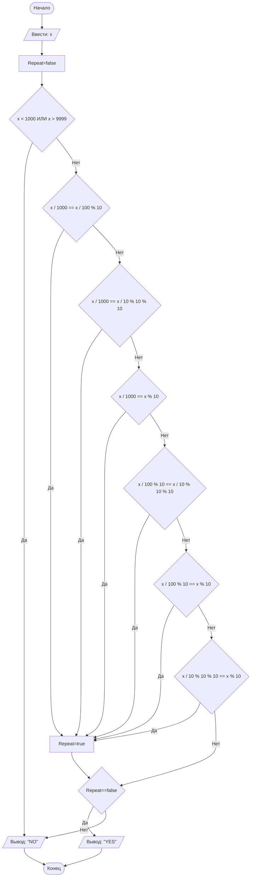
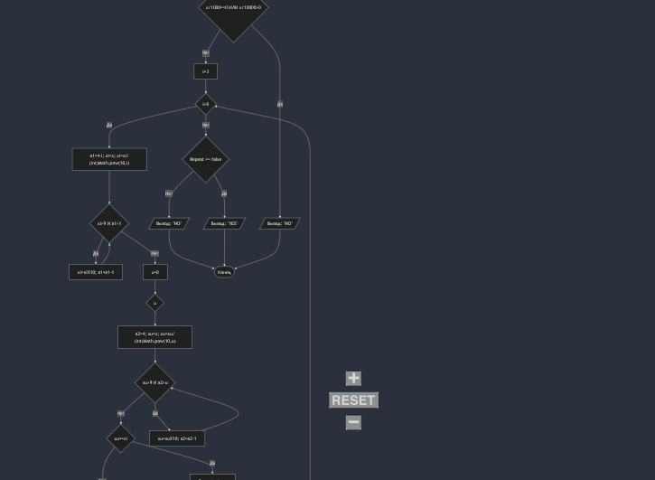

## Отчет по лабораторной работе № 1

#### № группы: `ПМ-2402`

#### Выполнил: `Хамуев Владимир Николаевич`

#### Вариант: `27`

### Cодержание:

- [Постановка задачи](#1-постановка-задачи)
- [Входные и выходные данные](#2-входные-и-выходные-данные)
- [Выбор структуры данных](#3-выбор-структуры-данных)
- [Алгоритм](#4-алгоритм)
- [Программа](#5-программа)
- [Анализ правильности решения](#6-анализ-правильности-решения)

### 1. Постановка задачи

- Условия задачи

> На вход программы подается натуральное число. Определить, является ли
оно 4-хзначным числом, все цифры которого различны ("YES"/"NO")

Данную задачу можно разделить на 2 подзадачи: определение количества знаков в числе и проверка их на повтор.

- Для 1 подзадачи нужно рассмотреть 3 случая:
  1. `X <= 9999` и `X >= 1000`
  2. `X < 1000` (отрицание 1 случая)
  3. `X > 9999` (отрицание 1 случая)
- Пусть `Z = количество повторов`, тогда для 2 подзадачи нужно рассмотреть 2 случая:
  1. `Z == 0`
  2. `Z > 0` (отрицание 1 случая)

Всего надо рассмотреть `3 * 2 = 6` случаев.

### 2. Входные и выходные данные

#### Данные на вход

На вход программа должна получать 1 число, при этом в условии сказано, что получаемое число относится к натуральным, то есть к целым положительным числам.

|           | Тип                       | min значение | max значение   |
|-----------|---------------------------|--------------|----------------|
| X (Число) | Натуральное число | 1            | 10<sup>9</sup> |

#### Данные на выход

Т.к. программа должна вывести либо "YES", либо "NO", то на выход мы получим строку.

|        | Тип    | значение   | значение   |
|--------|--------|------------|------------|
| Строка | Строка | "NO"       | "YES"      |

### 3. Выбор структуры данных

Программа получает 1 натуральное число, не превышающее 10<sup>9</sup>. Поэтому для его хранения
можно выделить 1 переменную (`x`) типа `int`.

|           | название переменной | Тип (в Java) | 
|-----------|---------------------|--------------|
| X (Число) | `x`                 | `int`        |

Для вывода результата необязательно его хранить в отдельной переменной.

### 4. Алгоритм

1. **Ввод данных:**  
   Программа считывает целое число, обозначенное как `x`.

2. **Подсчёт знаков:**  
   Программа проверяет число `x` на нахождение в интервале от 1000 до 9999. Если `x` входит в диапазон, программа переходит к следующему шагу для работы с `x`. Если `x` больше или меньше, программа прекращает выполнение действий.

3. **Проверка числа на повтор цифр:**
   Программа последовательно и попарно проверяет знаки в числе `x` на предмет повтора с помощью условных операторов if. Если в числе `x` найден повтор, на экран выводится строка `"NO"`. Если в числе `x` повтор не найден, на экран выводится строка `"YES"`.

4. **Вывод результата:**  
   На экран выводится либо строка `"YES"`, если число удовлетворяет условиям, либо строка `"NO"`.

#### Блок-схема


```mermaid
graph TD
    A([Начало]) --> B[/Ввести: x/]
    B --> Q[Repeat=false]
    Q --> C{x < 1000 ИЛИ x > 9999}
    C -- Да --> K[/Вывод: "NO"/]
    C -- Нет--> D{"x / 1000 == x / 100 % 10"}
    D -- Да --> X[Repeat=true]
    D -- Нет--> E{"x / 1000 == x / 10 % 10 % 10"}
    E -- Да --> X[Repeat=true]
    E -- Нет--> F{"x / 1000 == x % 10"}
    F -- Да --> X[Repeat=true]
    F -- Нет--> G{"x / 100 % 10 == x / 10 % 10 % 10"}
    G -- Да --> X[Repeat=true]
    G -- Нет--> H{"x / 100 % 10 == x % 10"}
    H -- Да --> X[Repeat=true]
    H -- Нет--> J{"x / 10 % 10 % 10 == x % 10"}
    J -- Да --> X[Repeat=true]
    J -- Нет--> L{Repeat==false}
    X --> L
    L -- Да --> P[/Вывод: "YES"/]
    L -- Нет--> K[/Вывод: "NO"/]
    P --> Z
    K --> Z([Конец])

```



### 5. Программа

```markdown
    ```java
        import java.io.PrintStream;
        import java.util.Scanner;
        public class Main {
        // Объявляем объект класса Scanner для ввода данных
        public static Scanner in = new Scanner(System.in);
        // Объявляем объект класса PrintStream для вывода данных
        public static PrintStream out = System.out;
        public static void main(String[] args) {
        // Считывание натурального числа x из консоли
            int x = in.nextInt();
            boolean Repeat = false;
            // Проверка числа x на нахождение в диапазоне от 1000 до 9999
            // Если x входит в диапазон, продолжаем работу, иначе выводим "NO"
            if (x < 1000 || x > 9999)
              out.print("NO");
            // Последовательная попарная проверка числа x на повтор знаков
            else {
            // Если первый и второй знаки в числе x повторяются, приравниваем Repeat к true
            if (x / 1000 == x / 100 % 10)
                Repeat = true;
            // Если первый и третий знаки в числе x повторяются, приравниваем Repeat к true
            if (x / 1000 == x / 10 % 10 % 10)
                Repeat = true;
            // Если первый и четвёртый знаки в числе x повторяются, приравниваем Repeat к true
            if (x / 1000 == x % 10)
                Repeat = true;
            // Если второй и третий знаки в числе x повторяются, приравниваем Repeat к true
            if (x / 100 % 10 == x / 10 % 10 % 10)
                Repeat = true;
            // Если второй и четвёртый знаки в числе x повторяются, приравниваем Repeat к true
            if (x / 100 % 10 == x % 10)
                Repeat = true;
            // Если третий и четвёртый знаки в числе x повторяются, приравниваем Repeat к true
            if (x / 10 % 10 % 10 == x % 10)
                Repeat = true;
            // Если Repeat равна false, выводим "YES", иначе выводим "NO"
            if (Repeat == false)
                out.print("YES");
            else
                out.print("NO");
        }
        }
        }
    ```
```

### 6. Анализ правильности решения

Программа работает корректно на всем множестве решений с учетом ограничений.

1. Тест на `X <= 9999` и `X >= 1000` и `Z == 0`:

  - **Input**:
      ```
      1234
      ```

  - **Output**:
      ```
      YES
      ```

2. Тест на `X < 1000` и `Z == 0`:

  - **Input**:
      ```
      987
      ```

  - **Output**:
      ```
      NO
      ```

3. Тест на `X > 9999` и `Z == 0`:

  - **Input**:
      ```
      12345
      ```

  - **Output**:
      ```
      NO
      ```

4. Тест на `X <= 9999` и `X >= 1000` и `Z > 0`:

   - **Input**:
       ```
       7777
       ```

   - **Output**:
       ```
       NO
       ```
  
5. Тест на `X < 1000` и `Z > 0`:

   - **Input**:
       ```
       999
       ```

   - **Output**:
       ```
       NO
       ```

6. Тест на `X > 9999` и `Z > 0`:

   - **Input**:
       ```
       333333
       ```

   - **Output**:
       ```
       NO
       ```

7. Тест на ограничение задачи:

  - **Input**:
      ```
      1000000000
      ```

  - **Output**:
      ```
      NO
      ```
